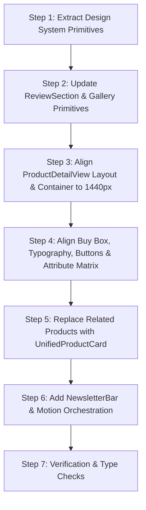

# Product Detail Page (PDP) Branding & Structural Alignment

> **Document Version:** 1.0.0  
> **Status:** Proposal / Ready for Review  
> **Target Scope:** Web Storefront (`app/[locale]/products/[slug]/ProductDetailView.tsx` & Design System)  
> **Reference Design:** Homepage Design 3 (`app/[locale]/page.tsx`, `app/[locale]/design-3/components/*`)  
> **Locales Supported:** English (`/en`), Russian (`/ru`), Chinese (`/zh`)  
> **Channels Supported:** Retail (B2C Cart), Wholesale RFQ (Quote Cart), Wholesale Instant (B2B Checkout)

---

## 1. Executive Summary

The main storefront homepage (`/`, `/en`, `/ru`, `/zh`) exhibits a distinct, polished, high-converting B2B/B2C retail visual identity (Design 3). It features a calm slate canvas (`#F8FAFC`), deep nautical brand navy (`#00407a`), energetic conversion amber (`#F5A602`), crisp card geometry with 12px/16px radii, micro-elevations (`shadow-2xs` / `shadow-xs`), and responsive Framer Motion orchestration.

In contrast, the live Product Detail Page (`ProductDetailView.tsx`) has drifted over iterations into a fragmented aesthetic:
- It mixes legacy Tailwind `gray-*` with `slate-*`, and raw `blue-600` with brand `#00407a`.
- It uses heavy SaaS-style gradients (`bg-gradient-to-r from-primary-600 via-primary-500` with heavy drop shadows and skew shimmers) on primary action buttons that contrast with the homepage's flat, tactile, clean-edged CTAs.
- It sits inside a `max-w-[1400px]` container with `px-4 sm:px-6 lg:px-8` insets, while the header, homepage sections, and footer all align to `max-w-[1440px]` with `px-4 lg:px-6`, causing an awkward 40px layout jump when navigating from home to product.
- It renders related products using an obsolete `ProductCard.tsx` component with dark-mode borders and hover animations that clash with the homepage's `UnifiedProductCard.tsx`.
- It lacks the structural breathing room, section headers, trust banners, and motion system that define the homepage experience.

This document presents a comprehensive, zero-breakage architectural plan to extract a unified design system (`components/design-system/`) and align the PDP with the homepage design language while strictly preserving all cart, quote, configurable attribute, matrix, gallery, review, and localization capabilities.

---

## 2. Homepage Design Language (Phase 1.1)

Evidence extracted directly from:
- `app/[locale]/page.tsx`
- `app/[locale]/design-3/components/Header.tsx`
- `app/[locale]/design-3/components/HeroBanner.tsx`
- `app/[locale]/design-3/components/CategoryGrid.tsx`
- `app/[locale]/design-3/components/FlashDeals.tsx`
- `app/[locale]/design-3/components/TrustFeatures.tsx`
- `app/[locale]/design-3/components/UnifiedProductCard.tsx`
- `app/[locale]/design-3/components/NewsletterBar.tsx`
- `app/[locale]/design-3/components/Footer.tsx`
- `tailwind.config.ts` & `app/globals.css`

| Element | Value / Class | Notes & Evidence |
|---|---|---|
| **Primary color** | `#00407a` (`bg-[#00407a]`, `text-[#00407a]`, `border-[#00407a]`) | Brand Navy used in Header logo, active pills, mega-menu, icon badges, and B2B RFQ buttons. Fallback in Tailwind config is `primary-500: #1a3a5c`. |
| **Secondary color** | `#F5A602` (`bg-[#F5A602]`, hover `bg-[#E09500]`) | High-conversion Amber/Gold used in search submit, Add to Cart buttons, stock progress bars, and hot tags. Config fallback: `secondary-500: #c9a84c`. |
| **Accent color** | `#EF4444` / `#DC2626` (`bg-red-500`, `text-red-600`) | Used for flash sale badges (`FlashDeals.tsx:87`), limited stock warnings, and discount tags. |
| **Background color** | `#F8FAFC` (`bg-[#F8FAFC]`) | Global page background on root `<div className="min-h-screen flex flex-col bg-[#F8FAFC]">` and top utility header. |
| **Card background** | `bg-white` | Pure white cards set against the `#F8FAFC` page canvas with `border border-slate-200` or `border-slate-200/90`. |
| **Text primary** | `text-slate-900` (`#0F172A`) | Used across all headlines, product titles, prices, and high-emphasis labels. |
| **Text muted** | `text-slate-500` (`#64748B`) / `text-slate-400` | Used for subheaders, breadcrumbs, specifications labels, and secondary metadata. |
| **Font family (display)** | `'Inter', system-ui, sans-serif` | Clean, high-density sans-serif. (`globals.css` defines Playfair Display, but homepage components deliberately enforce `font-['Inter'] font-black tracking-tight` for international commercial clarity). |
| **Font family (body)** | `'Inter', system-ui, sans-serif` | Enforced at `globals.css` base layer (`line 33`). |
| **H1 size** | `text-2xl sm:text-3xl font-black tracking-tight` | Header brand: `text-2xl font-black`. Hero title: `text-2xl sm:text-3xl lg:text-4xl font-black`. |
| **H2 size** | `text-xl sm:text-2xl font-black text-slate-900 tracking-tight` | Used uniformly on `CategoryGrid.tsx:108`, `FlashDeals.tsx:81`, `FreshSupermarketSection.tsx`. |
| **Body size** | `text-xs` (12px) & `text-sm` (14px) | Dense European/Asian retail e-commerce scale (e.g. 5element / emall / AliExpress rhythm). |
| **Border radius (cards)** | `rounded-xl` (12px) & `rounded-2xl` (16px) | Product cards and small items use `rounded-xl` (`UnifiedProductCard.tsx:41`); sections, hero banners, and newsletter use `rounded-2xl`. |
| **Border radius (buttons)** | `rounded-md` (6px), `rounded-lg` (8px), `rounded-full` | Action buttons in cards use `rounded-md` (6px) or `rounded-lg` (8px); department and category pills use `rounded-full`. |
| **Shadow (card)** | `shadow-2xs`, `shadow-xs`, `hover:shadow-md` | Restrained, realistic micro-shadows. Special accent: `hover:shadow-[0_8px_20px_rgba(0,64,122,0.06)]`. |
| **Shadow (button)** | `shadow-xs` / `shadow-md` | Flat button elevation; never overblown 30px SaaS blurs. |
| **Section padding (vertical)** | `py-4` to `py-6` | Consistent vertical rhythm between sections. |
| **Section padding (horizontal)** | `px-4 lg:px-6` | Enforced on every container wrapper (`max-w-[1440px] mx-auto px-4 lg:px-6`). |
| **Container max-width** | `max-w-[1440px] mx-auto` | Standard width across Header, Hero, Categories, Grids, and Footer. |
| **Grid gap** | `gap-3 sm:gap-4` | Compact, scan-friendly grid density. |
| **Animation timing** | `duration-200`, `duration-300`, `framer-motion` | Smooth cubic-bezier `ease: [0.215, 0.61, 0.355, 1.0]`, scale taps `scale: 0.96`, hover `scale: 1.01`. |
| **Header style** | Sticky 3-tier header | Top utility bar (`bg-[#F8FAFC]`), main search bar (`bg-white/98 backdrop-blur-md`), and category ribbon (`h-11`). |
| **Footer style** | Dark nautical footer | `bg-[#051121]` with `bg-[#07172B]/60` 4-card value pillars strip, 5-col link matrix, and SSL badge. |

---

## 3. PDP Current Design (Phase 1.2)

Evidence extracted directly from:
- `app/[locale]/products/[slug]/page.tsx`
- `app/[locale]/products/[slug]/ProductDetailView.tsx`
- `components/layout/SharedLayout.tsx`
- `components/products/ProductCard.tsx`
- `components/ui/Container.tsx`

| Element | Value / Class | Notes & Evidence |
|---|---|---|
| **Primary color** | `primary-600` (`#102a43`), `blue-600` (`#2563eb`), `#1a3a5c` | Mixed wildly across the page: `bg-primary-600` (`line 1501`), `bg-blue-600` (`line 1214`), `text-blue-700` (`line 1057`). Lacks the signature `#00407a` Navy. |
| **Secondary color** | `text-gradient-gold` (CSS class), `yellow-400` (stars) | Price uses gold text gradient (`line 1018`), stars use raw `yellow-400`, but buttons do not use the conversion amber `#F5A602`. |
| **Accent color** | `text-red-600`, `rose-600`, `destructive` | Discount badge uses `variant="destructive"` (`line 1031`), out of stock uses `bg-red-100 text-red-700`. |
| **Background color** | `bg-gradient-to-b from-gray-50 to-white` (`line 766`) | A vertical wash from legacy gray-50 to pure white, clashing with the header's `#F8FAFC`. |
| **Card background** | `bg-white`, `bg-gray-50`, `bg-blue-50/50` | Inconsistent card surfaces: price card is `bg-white border-gray-100`, quantity selector is `bg-gray-50 border-gray-200`, matrix is `border-2 border-blue-200`. |
| **Text primary** | `text-gray-900` (`#111827`) | Standard Tailwind neutral gray instead of the refined `text-slate-900` used on homepage. |
| **Text muted** | `text-gray-500`, `text-gray-600`, `text-slate-500` | Mixture of both `gray-*` and `slate-*` throughout the component. |
| **Font family (display)** | `text-gradient-gold font-bold` | Uses standard serif or Inter depending on CSS class, but lacks homepage tracking. |
| **Font family (body)** | Inter | Inherited from `globals.css`. |
| **H1 size** | `text-2xl lg:text-3xl font-bold text-gray-900` (`line 1004`) | Standard font-bold, missing `font-black tracking-tight` authority. |
| **H2 size** | `text-xl font-bold text-slate-900` (`line 2292`) | Smaller font weight compared to homepage's `text-xl sm:text-2xl font-black`. |
| **Body size** | `text-xs`, `text-sm`, `text-base` | Text sizes vary with inconsistent leading. |
| **Border radius (cards)** | `rounded-lg` (8px), `rounded-xl` (12px), `rounded-2xl` (16px) | Clashing radii: Buy box sub-cards are `rounded-lg` (`line 1007`), Matrix is `rounded-xl` (`line 1090`), Assurance card is `rounded-2xl` (`line 811`). |
| **Border radius (buttons)** | `rounded-xl` (12px), `rounded-lg` (8px), `rounded-md` | Main CTA is `rounded-xl` (`line 1501`), matrix button is `rounded-lg` (`line 1214`), steppers are `rounded-md`. |
| **Shadow (card)** | `shadow-sm`, `shadow-md`, `shadow-xs` | Different shadow classes applied arbitrarily across sub-boxes. |
| **Shadow (button)** | `shadow-[0_8px_30px_rgb(26,58,92,0.2)]` | Heavy SaaS drop shadow with hover expansion (`line 1501`) that does not exist anywhere on the homepage. |
| **Section padding (vertical)** | Single `py-4 pb-28 lg:pb-12` | Monolith page container without distinct, rhythmically spaced section blocks. |
| **Section padding (horizontal)** | `px-4 sm:px-6 lg:px-8` | Rendered via `<Container maxWidth="2xl">` (`Container.tsx:30`), conflicting with homepage's `px-4 lg:px-6`. |
| **Container max-width** | `max-w-[1400px]` | From `Container.tsx:26` (`2xl: 'max-w-[1400px]'`), while homepage is `max-w-[1440px]`. |
| **Grid gap** | `gap-6` on main 12-col grid | Main grid is `lg:grid-cols-12 gap-6`. |
| **Animation timing** | `animate-fade-in` (CSS keyframe) | Basic CSS opacity fade-in. Lacks Framer Motion springs, staggered cards, or reveal-on-scroll. |
| **Header integration** | Uses `Design3LayoutHeader` inside `SharedLayout` | Rendered via `SharedLayout.tsx:49`. Header is identical, but the page content below it is misaligned. |
| **Footer integration** | Uses `Design3LayoutFooter` inside `SharedLayout` | Rendered via `SharedLayout.tsx:70`. |

---

## 4. Design Comparison & Diff Table (Phase 1.3)

| Element | Homepage (Design 3) | PDP Current (`ProductDetailView`) | Inconsistent? | Recommended Alignment |
|---|---|---|---|---|
| **Canvas Background** | `#F8FAFC` (`bg-[#F8FAFC]`) | `bg-gradient-to-b from-gray-50 to-white` | **YES** | Set page canvas to `bg-[#F8FAFC]` for seamless visual continuation from homepage. |
| **Container Width** | `max-w-[1440px] mx-auto px-4 lg:px-6` | `max-w-[1400px] mx-auto px-4 sm:px-6 lg:px-8` | **YES** | Standardize PDP to `max-w-[1440px] mx-auto px-4 lg:px-6` to eliminate 40px width shift. |
| **Primary Button (Retail)** | `#F5A602` hover `#E09500`, dark text, flat, `shadow-xs`, `rounded-lg`, `whileTap={{ scale: 0.96 }}` | `bg-gradient-to-r from-primary-600` with 30px shadow, skew shimmer, `hover:scale-[1.02]` | **YES** | Adopt homepage `#F5A602` amber CTA with bold text, clean border, and Framer Motion tap spring. |
| **Secondary Button (B2B RFQ)** | `#00407a` Navy hover `#003366`, white text, flat, `shadow-xs` | `border-2 border-primary-600 text-primary-700` or blue gradient | **YES** | Use `#00407a` solid or clean outline matching `UnifiedProductCard.tsx:311`. |
| **Card Radii & Borders** | Standardized `rounded-xl` (12px) or `rounded-2xl` (16px), `border-slate-200` | Mixed `rounded-lg`, `rounded-xl`, `rounded-2xl`, `border-gray-100`, `border-blue-300` | **YES** | Standardize: sub-cards use `rounded-xl border border-slate-200/90`, major containers use `rounded-2xl`. |
| **Color Neutral Tokens** | Pure `slate-*` (`slate-900`, `slate-700`, `slate-500`, `slate-200`) | Mixed `gray-*` (`gray-900`, `gray-600`) and `slate-*` | **YES** | Canonicalize all neutrals to Tailwind `slate-*`. |
| **Typography (Headings)** | `font-black text-slate-900 tracking-tight` | `font-bold text-gray-900` | **YES** | Upgrade product H1 to `font-black text-slate-900 tracking-tight` with matching line height. |
| **Price Display** | Plain bold `text-slate-900 font-black` with wholesale tag | `text-gradient-gold font-bold` | **YES** | Harmonize price display: large `text-2xl sm:text-3xl font-black text-slate-900` with clear savings pills. |
| **Quantity Stepper** | Clean white box inside `bg-slate-100` pill with `Minus`/`Plus` buttons | Standalone input with grey border | **YES** | Adopt the rapid-stepper design from `UnifiedProductCard.tsx:413`. |
| **Related Products** | `UnifiedProductCard.tsx` (real MOQ, quote-cart support, sleek tags) | Outdated `ProductCard.tsx` (dark mode classes, blue top bar, heavy shadow) | **YES** | Replace `ProductCard` with `UnifiedProductCard` in the Related Products grid. |
| **Trust Presentation** | 4-card `TrustFeatures.tsx` grid (`#EFF6FF` icon boxes, `#00407a` icons) | Tiny `TrustBadgesMini` inside buy box column | **YES** | Promote trust guarantees to a full-width section or dedicated card matching `TrustFeatures`. |
| **Section Cadence** | Rhythm of distinct sections with headers and subtitles | One giant monolithic scroll | **YES** | Restructure PDP into discrete sections with consistent section padding (`py-6`). |
| **Motion** | Orchestrated Framer Motion (`MotionReveal`, `whileTap`, stagger) | CSS `@keyframes fade-in` only | **YES** | Add Framer Motion reveals for sections and responsive hover/press states. |

---

## 5. Reusable Components Inventory (Phase 1.4)

Components from the homepage (`app/[locale]/design-3/components/`) identified for direct reuse or adaptation on PDP:

| Component | File Path | Current Usage | Suitability for PDP | Action |
|---|---|---|---|---|
| **Header** | `design-3/components/Header.tsx` (via `Design3LayoutHeader`) | Homepage top navigation | **100% Reusable** | Already mounted via `SharedLayout` / `Design3LayoutHeader`. Keep as-is. |
| **Footer** | `design-3/components/Footer.tsx` (via `Design3LayoutFooter`) | Homepage footer with 4 value pillars | **100% Reusable** | Already mounted via `SharedLayout` / `Design3LayoutFooter`. Keep as-is. |
| **UnifiedProductCard** | `design-3/components/UnifiedProductCard.tsx` | Used on Flash Deals, Fresh, Electronics, Best Sellers | **100% Reusable** | **Replace `components/products/ProductCard.tsx`** in PDP "Related Products" with `UnifiedProductCard`. Supports MOQ, wholesale/retail switching, and identical card visual tokens. |
| **TrustFeatures** | `design-3/components/TrustFeatures.tsx` | 4 value proposition cards on homepage | **Adaptable** | Can be imported directly below the Hero Buy Box as a full-width trust assurance strip. |
| **NewsletterBar** | `design-3/components/NewsletterBar.tsx` | Homepage pre-footer subscription bar | **100% Reusable** | Mount above the footer on PDP to give the bottom of the page the exact same closing rhythm. |
| **MotionReveal** | `components/motion/MotionReveal.tsx` | Scroll-triggered section reveals | **100% Reusable** | Wrap PDP sections (Tabs, FAQ, Related Products, Newsletter) in `<MotionReveal direction="up">`. |
| **ProductImageGallery** | `components/products/ProductImageGallery.tsx` | PDP image viewer with thumbnails | **Keep PDP-specific** | Keep functional core, but update container radius to `rounded-2xl` and thumbnail border to `border-slate-200`. |
| **ReviewSection** | `components/products/ReviewSection.tsx` | Customer feedback and star ratings | **Keep PDP-specific** | Update card styling, button styling, and star icons to match Design 3 tokens. |

---

## 6. Design System Proposal (Phase 2.1)

To ensure this alignment is durable and prevents future visual drift across all storefront pages, we propose extracting a shared design system under `components/design-system/`:

```
components/design-system/
├── tokens.ts          # Central source of truth for colors, radii, shadows, spacing
├── Container.tsx      # Unified 1440px container with responsive px-4 lg:px-6 insets
├── Section.tsx        # Section wrapper with standard vertical padding & optional header
├── Card.tsx           # Standardized card with variants (default, flat, highlighted, interactive)
├── Button.tsx         # Unified button (primary amber, brand navy, outline, ghost)
├── Badge.tsx          # Consistent pill badge (new, discount, wholesale, verified)
├── Typography.tsx     # Standardized H1, H2, H3, subtitle, and price typography primitives
└── index.ts           # Barrel export
```

### Component Specifications

#### 1. `tokens.ts`
```typescript
export const DESIGN_TOKENS = {
  colors: {
    brandNavy: '#00407a',
    brandNavyHover: '#003366',
    brandNavyLight: '#EFF6FF',
    accentAmber: '#F5A602',
    accentAmberHover: '#E09500',
    accentAmberLight: '#FEF3C7',
    canvasBg: '#F8FAFC',
    cardBg: '#FFFFFF',
    borderDefault: '#E2E8F0', // slate-200
    borderLight: '#F1F5F9',   // slate-100
    textPrimary: '#0F172A',   // slate-900
    textSecondary: '#475569', // slate-600
    textMuted: '#64748B',     // slate-500
  },
  radius: {
    sm: 'rounded-md',   // 6px
    md: 'rounded-lg',   // 8px
    card: 'rounded-xl', // 12px
    box: 'rounded-2xl', // 16px
    pill: 'rounded-full',
  },
  shadows: {
    subtle: 'shadow-2xs',
    card: 'shadow-xs',
    hover: 'hover:shadow-md hover:shadow-slate-900/5',
    elevation: 'shadow-lg shadow-slate-900/10',
  },
  layout: {
    maxWidth: 'max-w-[1440px]',
    paddingX: 'px-4 lg:px-6',
    paddingSectionY: 'py-6 sm:py-8',
  }
} as const;
```

#### 2. `Container.tsx`
```tsx
import React from 'react';

interface ContainerProps {
  children: React.ReactNode;
  className?: string;
}

export const Container: React.FC<ContainerProps> = ({ children, className = '' }) => (
  <div className={`w-full max-w-[1440px] mx-auto px-4 lg:px-6 ${className}`}>
    {children}
  </div>
);
```

#### 3. `Section.tsx`
```tsx
import React from 'react';
import { Container } from './Container';

interface SectionProps {
  children: React.ReactNode;
  id?: string;
  title?: string;
  subtitle?: string;
  badge?: string;
  action?: React.ReactNode;
  className?: string;
  noContainer?: boolean;
}

export const Section: React.FC<SectionProps> = ({
  children,
  id,
  title,
  subtitle,
  badge,
  action,
  className = '',
  noContainer = false,
}) => {
  const content = (
    <div className={`py-6 sm:py-8 ${className}`} id={id}>
      {(title || subtitle || action) && (
        <div className="flex flex-col sm:flex-row sm:items-end justify-between mb-5 gap-3">
          <div>
            <div className="flex items-center gap-2">
              {title && (
                <h2 className="text-xl sm:text-2xl font-black text-slate-900 tracking-tight">
                  {title}
                </h2>
              )}
              {badge && (
                <span className="bg-[#EFF6FF] text-[#00407a] text-[10px] font-black px-2.5 py-0.5 rounded-full border border-blue-200 uppercase tracking-wide">
                  {badge}
                </span>
              )}
            </div>
            {subtitle && (
              <p className="text-xs sm:text-sm text-slate-500 mt-1">
                {subtitle}
              </p>
            )}
          </div>
          {action && <div className="shrink-0">{action}</div>}
        </div>
      )}
      {children}
    </div>
  );

  return noContainer ? content : <Container>{content}</Container>;
};
```

#### 4. `Button.tsx`
```tsx
import React from 'react';
import { motion } from 'framer-motion';

interface ButtonProps extends React.ButtonHTMLAttributes<HTMLButtonElement> {
  variant?: 'primary' | 'brand' | 'outline' | 'ghost';
  size?: 'sm' | 'md' | 'lg';
  fullWidth?: boolean;
  isLoading?: boolean;
}

export const Button: React.FC<ButtonProps> = ({
  children,
  variant = 'primary',
  size = 'md',
  fullWidth = false,
  isLoading = false,
  className = '',
  disabled,
  ...props
}) => {
  const variantStyles = {
    primary: 'bg-[#F5A602] hover:bg-[#E09500] text-slate-950 font-bold shadow-xs',
    brand: 'bg-[#00407a] hover:bg-[#003366] text-white font-bold shadow-xs',
    outline: 'border border-slate-300 hover:border-slate-400 bg-white text-slate-800 font-semibold',
    ghost: 'hover:bg-slate-100 text-slate-700 font-semibold',
  };

  const sizeStyles = {
    sm: 'px-3 py-1.5 text-xs rounded-md',
    md: 'px-4 py-2 text-sm rounded-lg',
    lg: 'px-6 py-3 text-base rounded-xl',
  };

  return (
    <motion.button
      whileTap={{ scale: 0.97 }}
      disabled={disabled || isLoading}
      className={`inline-flex items-center justify-center gap-2 transition-all cursor-pointer disabled:opacity-50 disabled:cursor-not-allowed ${variantStyles[variant]} ${sizeStyles[size]} ${fullWidth ? 'w-full' : ''} ${className}`}
      {...(props as any)}
    >
      {children}
    </motion.button>
  );
};
```

---

## 7. PDP Restructure Proposal (Phase 2.2)

### Structural Comparison: Homepage vs. Proposed PDP

```
HOMEPAGE (Design 3)                    PROPOSED PDP
┌────────────────────────────────┐     ┌────────────────────────────────┐
│ 1. Header (Sticky 3-Tier)      │     │ 1. Header (Sticky 3-Tier)      │
├────────────────────────────────┤     ├────────────────────────────────┤
│ 2. Hero Banner & Banners Grid  │     │ 2. Clean Breadcrumb Trail      │
├────────────────────────────────┤     ├────────────────────────────────┤
│ 3. Category Grid               │     │ 3. Hero Product Showcase       │
├────────────────────────────────┤     │    ├── Left: Gallery & Zoom    │
│ 4. Flash Deals (Rolling Timer) │     │    └── Right: Buy Box & Specs  │
├────────────────────────────────┤     ├────────────────────────────────┤
│ 5. Four Trust Features Grid    │     │ 4. Sourcing & Escrow Badges    │
├────────────────────────────────┤     ├────────────────────────────────┤
│ 6. Kitchenware Essentials Grid │     │ 5. Product Hub (Tabs)          │
├────────────────────────────────┤     │    ├── Overview / Details      │
│ 7. Electronics & Appliances    │     │    ├── Full Specifications     │
├────────────────────────────────┤     │    ├── Packaging & Logistics   │
│ 8. Top Rated Best Sellers      │     │    ├── Buyer Q&A / FAQ         │
├────────────────────────────────┤     │    └── Customer Reviews        │
│ 9. Official Brand Zones        │     ├────────────────────────────────┤
├────────────────────────────────┤     │ 6. You May Also Like (Related) │
│ 10. Weekly Bargains Section    │     │    (Uses UnifiedProductCard)   │
├────────────────────────────────┤     ├────────────────────────────────┤
│ 11. Member Club Banner         │     │ 7. Customer Support Help Strip │
├────────────────────────────────┤     ├────────────────────────────────┤
│ 12. Newsletter Subscription    │     │ 8. Newsletter Subscription     │
├────────────────────────────────┤     ├────────────────────────────────┤
│ 13. Footer (Deep Navy + 4 P.)  │     │ 9. Footer (Deep Navy + 4 P.)   │
└────────────────────────────────┘     └────────────────────────────────┘
```

### Section-by-Section Plan

1. **Header (Design3LayoutHeader):**
   - *Mirrors Homepage:* Identical.
   - *Changes:* None.

2. **Breadcrumb Trail:**
   - *Mirrors Homepage:* Styled consistently with the category navigation ribbon.
   - *Changes:* Replace gray text with `text-slate-500`, active crumb `font-bold text-slate-900`, chevron divider `text-slate-400`.

3. **Hero Product Showcase (Split 12-col Grid):**
   - *Left Column (6 cols):*
     - `ProductImageGallery`: White rounded-2xl container (`bg-white border border-slate-200/90 rounded-2xl p-4 shadow-xs`).
     - Thumbnails: `rounded-xl border border-slate-200` with active ring `ring-2 ring-[#00407a]`.
   - *Right Column (6 cols) - Buy Box:*
     - Header: Category badge (`bg-blue-50 text-[#00407a] font-bold text-xs rounded-full px-3 py-1`), SKU in `font-mono text-slate-400`.
     - Title: `text-2xl sm:text-3xl font-black text-slate-900 tracking-tight`.
     - Ratings: Reviews star summary with count link.
     - Price Card: Clean `bg-white border border-slate-200 rounded-xl p-4 shadow-xs`. Price in `text-3xl font-black text-slate-900`. Wholesale tag in `font-mono text-[#00407a] font-bold`.
     - Attribute Matrix / Selectors: Clean pills with `rounded-lg border border-slate-200`. Active option: `border-[#00407a] bg-blue-50 text-[#00407a] font-bold`.
     - Quantity Stepper: Embedded inside `bg-slate-100 rounded-lg p-1` matching `UnifiedProductCard`.
     - Action CTAs:
       - **Retail "Add to Cart":** Solid `#F5A602` amber button with `whileTap={{ scale: 0.97 }}`.
       - **B2B "Add to Quote List":** Solid `#00407a` navy button with `whileTap={{ scale: 0.97 }}`.
       - **Wholesale Instant "Add to Wholesale Cart":** Amber button with `(MOQ: X)` indicator.

4. **Sourcing & Escrow Guarantee Strip:**
   - *Mirrors Homepage:* `TrustFeatures.tsx`.
   - *Changes:* 4-column grid (`bg-white border border-slate-200 rounded-xl p-4 shadow-xs`) highlighting: Quality Inspection, Direct China Export, Samples & OEM, Escrow Protected Order.

5. **Product Specifications & Details Hub (Tabs):**
   - *Mirrors Homepage:* Clean card tab header with `border-b-2 border-[#00407a] text-[#00407a] font-black`.
   - *Changes:* Standardize specifications dl/dt grid into clean two-column striped rows (`bg-slate-50/50` alternating).

6. **Related Products Section:**
   - *Mirrors Homepage:* `FlashDeals` / `FreshSupermarketSection` grid.
   - *Changes:* **Swap out `ProductCard.tsx` in favor of `UnifiedProductCard.tsx`**. Renders 4 or 6 cards in a 4-col responsive grid (`grid-cols-2 sm:grid-cols-3 lg:grid-cols-4 gap-4`).

7. **Help & Customer Support Strip:**
   - *Mirrors Homepage:* Clean callout bar (`bg-[#00407a] text-white rounded-2xl p-6`).

8. **NewsletterBar:**
   - *Mirrors Homepage:* Exact import of `NewsletterBar.tsx`.
   - *Changes:* Reuses component directly before the footer.

9. **Footer:**
   - *Mirrors Homepage:* Identical.

---

## 8. Visual Language Mapping (Phase 2.3)

| PDP Element | Current Style | Homepage Equivalent | Proposed Concrete Change |
|---|---|---|---|
| **Buy Box Card** | Fragmented cards with `border-gray-100` and `bg-gray-50` | `bg-white border border-slate-200 rounded-xl shadow-xs` | Wrap buy box sections in unified `rounded-xl border border-slate-200 bg-white p-4 shadow-xs`. |
| **Primary CTA (Retail)** | Gradient `from-primary-600 via-primary-500` with 30px shadow & shimmer | Amber `#F5A602` flat button with subtle `shadow-xs` | `bg-[#F5A602] hover:bg-[#E09500] text-slate-950 font-bold h-12 rounded-xl w-full shadow-xs`. |
| **Primary CTA (B2B)** | Outline `border-2 border-primary-600 text-primary-700` | Navy `#00407a` flat button | `bg-[#00407a] hover:bg-[#003366] text-white font-bold h-12 rounded-xl w-full shadow-xs`. |
| **Quantity Stepper** | Standalone grey input with `-` and `+` outline buttons | Integrated rapid-stepper | Integrated `bg-slate-100 border border-slate-200 rounded-lg p-1` with tactile micro-buttons. |
| **Gallery Thumbnails** | `rounded-lg border` with simple blue border | `rounded-xl` with `ring-2 ring-[#00407a]` | `rounded-xl overflow-hidden border border-slate-200 hover:border-slate-400 active:ring-2 active:ring-[#00407a]`. |
| **Spec Table** | Gray text list inside tab container | Two-column zebra striping with slate text | `divide-y divide-slate-100 text-xs sm:text-sm dt:text-slate-500 dd:font-semibold text-slate-900`. |
| **Review Card** | Standard border box | `bg-white border border-slate-200 rounded-xl p-5 shadow-2xs` | Wrap reviews in `rounded-xl border border-slate-200 bg-white p-5` with amber star SVGs. |
| **Related Products** | Obsolete `ProductCard` with blue top line | `UnifiedProductCard` | Use `<UnifiedProductCard variant="standard" />` in a responsive 4-column grid. |

---

## 9. Motion Consistency (Phase 2.4)

The homepage uses Framer Motion extensively (`MotionReveal`, `AnimatePresence`, `whileHover`, `whileTap`). The PDP currently relies on static CSS `@keyframes fade-in`.

### Proposed PDP Motion System

1. **Section Reveal on Scroll (`MotionReveal`):**
   - Wrap the Product Hub Tabs, Related Products, and Newsletter in `<MotionReveal direction="up" delay={0.1}>`.
   - Uses native IntersectionObserver with `viewport={{ once: true, margin: '-40px' }}`.

2. **Interactive Button Spring (`whileTap`):**
   - Add `whileTap={{ scale: 0.97 }}` to Add to Cart, Request Quote, and Variant selector buttons.
   - Micro-interaction feedback duration: 150ms.

3. **Card Hover Elevators (`whileHover`):**
   - Related product cards and Trust feature cards lift by `-3px` with `whileHover={{ y: -3, scale: 1.01 }}` and smooth easing.

4. **Gallery Crossfade Transition:**
   - Active gallery image transitions smoothly using `AnimatePresence mode="wait"` with a subtle 200ms opacity fade to prevent layout shift.

5. **Accessibility / Reduced Motion:**
   - Homepage `globals.css` lines 73–83 already define:
     ```css
     @media (prefers-reduced-motion: reduce) {
       *, *::before, *::after {
         animation-duration: 0.01ms !important;
         transition-duration: 0.01ms !important;
       }
     }
     ```
   - All Framer Motion variants on PDP will respect this setting automatically.

---

## 10. Implementation Plan (Phase 3)

### 3.1 Files to Create
1. `ecommerce-monorepo/web/components/design-system/tokens.ts` (Design tokens)
2. `ecommerce-monorepo/web/components/design-system/Container.tsx` (1440px container)
3. `ecommerce-monorepo/web/components/design-system/Section.tsx` (Section wrapper with header)
4. `ecommerce-monorepo/web/components/design-system/Button.tsx` (Unified button primitive)
5. `ecommerce-monorepo/web/components/design-system/Badge.tsx` (Unified badge primitive)
6. `ecommerce-monorepo/web/components/design-system/Card.tsx` (Standard card primitive)
7. `ecommerce-monorepo/web/components/design-system/index.ts` (Barrel export)

### 3.2 Files to Update
1. `ecommerce-monorepo/web/app/[locale]/products/[slug]/ProductDetailView.tsx`
   - Refactor outer layout to use design system `Container` (`max-w-[1440px] px-4 lg:px-6`).
   - Replace CTA buttons with Design 3 Amber/Navy tokens and Framer Motion spring physics.
   - Canonicalize all `gray-*` classes to `slate-*`.
   - Update Buy Box sub-cards and borders to `rounded-xl border-slate-200`.
   - Swap `ProductCard` with `UnifiedProductCard` in Related Products.
   - Insert `NewsletterBar` before footer.
2. `ecommerce-monorepo/web/components/products/ReviewSection.tsx`
   - Harmonize typography, button styling, and badge tokens to Design 3 slate theme.
3. `ecommerce-monorepo/web/components/products/ProductImageGallery.tsx`
   - Update image stage border and thumbnail selection ring to `#00407a`.

### 3.3 Order of Implementation



1. **Step 1:** Create `components/design-system/` with tokens and primitives. Run `tsc --noEmit` to verify type safety.
2. **Step 2:** Refactor `ProductImageGallery` and `ReviewSection` subcomponents to use slate tokens.
3. **Step 3:** Update `ProductDetailView.tsx` container width and outer background (`bg-[#F8FAFC]`).
4. **Step 4:** Align Buy Box typography, primary buttons (amber `#F5A602` for retail, navy `#00407a` for RFQ), and quantity steppers.
5. **Step 5:** Wire `UnifiedProductCard` into the "You May Also Like" grid.
6. **Step 6:** Mount `NewsletterBar` and apply `MotionReveal` on scroll.
7. **Step 7:** Perform cross-locale, responsive, and functional test pass.

---

## 11. Verification Plan

| Area | Checkpoint | Verification Method | Expected Result |
|---|---|---|---|
| **1. Visual Continuity** | Transition from `/en` to `/en/products/[slug]` | Browser inspection at 1440px | No horizontal width jump; canvas remains `#F8FAFC`; typography and button colors match homepage exactly. |
| **2. Add to Cart (Retail)** | Click "Add to Cart" with quantity > 1 | Click button, inspect network `POST /api/cart` and CartDrawer count | Item added to retail cart; cart count badge in header increments immediately. |
| **3. Request Quote (B2B)** | Click "Add to Quote List" | Click button, inspect QuoteCartContext | Item added to Quote Cart; header quote counter reflects item count. |
| **4. Wholesale Matrix** | Enter quantities across 2+ matrix variants | Enter qty, click "Add Assortment to Quote List" | All variants bundled with MOQ validation and sent to quote cart. |
| **5. Configurable Attributes** | Select Color and Size options | Click attribute pills | Selected state highlights in `#00407a` blue; active SKU, price, and stock update smoothly. |
| **6. Image Gallery** | Hover/click gallery thumbnails | Click secondary images | Active image switches without layout shift; zoom dialog functions normally. |
| **7. Multi-Locale** | Check `/en`, `/ru`, and `/zh` URLs | Navigate through all 3 language versions | All translations (breadcrumbs, tabs, buy box, specs) render without missing keys or hydration errors. |
| **8. Responsive Breakpoints** | Test at 375px, 768px, 1440px | Chrome DevTools device mode | Sticky mobile bottom bar renders correctly on mobile; grid collapses cleanly from 12 cols to 1 col. |
| **9. Related Products** | Verify "You May Also Like" cards | Check cards at bottom of PDP | Displays `UnifiedProductCard` with working wishlist, add to cart, and hover zoom. |
| **10. Type Check** | Automated TypeScript check | `npx tsc --noEmit` | **0 errors**. |

---

## 12. Estimated Effort per Step

| Step | Scope | Complexity | Estimated Effort |
|---|---|---|---|
| **Step 1** | Extract design system tokens & primitives (`components/design-system/`) | Low | ~30 mins |
| **Step 2** | Subcomponents polish (`ProductImageGallery`, `ReviewSection`) | Low | ~25 mins |
| **Step 3** | PDP outer container, background, and breadcrumb alignment | Low | ~20 mins |
| **Step 4** | Buy Box overhaul (typography, amber CTA, navy quote button, stepper) | Medium | ~45 mins |
| **Step 5** | Matrix and Configurable Attributes styling alignment | Medium | ~30 mins |
| **Step 6** | Related Products swap to `UnifiedProductCard` & Newsletter insertion | Low | ~25 mins |
| **Step 7** | Full verification pass (3 locales, 3 viewport sizes, typecheck) | Medium | ~35 mins |
| **Total** | | | **~3.5 hours** |

---

## 13. Risks and Mitigations

| Risk | Impact | Mitigation Strategy |
|---|---|---|
| **Breaking Wholesale MOQ / B2B Quote logic** | High (Revenue/Order loss) | Do NOT touch the state management or API payload logic in `handleAddToCart` and `handleAddToQuoteList`. Only refactor the presentation layer (JSX & CSS classes). |
| **SSR Hydration Mismatch** | Medium (Console warnings / Layout flicker) | Avoid client-only state checks (like `localStorage` or `window`) during initial render. Use the same static fallbacks established in recent header fixes. |
| **Attribute Option Translation Loss** | High (Degraded UX for Russian/Chinese buyers) | Retain all existing helper calls (`getLocalizedOptionLabel`, `getLocalizedColorName`, `getLocalizedCountry`, `getLocalizedMaterial`). |
| **Related Products Data Incompatibility** | Medium (Runtime crash) | Map the related product API response through `mapDbProductToDesign3` adapter so `UnifiedProductCard` receives its expected typed schema. |
| **Mobile Sticky Bar Collision** | Medium (Obscured CTA buttons) | Maintain the existing `pb-28 lg:pb-12` bottom padding on the main container so content scrolls clear of the fixed mobile bottom bar. |

---

## 14. Open Questions for Review

1. **Trade Assurance Card Placement:**
   - Currently, the PDP displays the Trade Assurance card in two places: desktop (under the gallery on the left) and mobile (under the buy box). Should we keep this split placement, or promote it to a dedicated full-width 4-pillar section (mirroring `TrustFeatures.tsx`) immediately below the Buy Box?
   *(Recommendation: Keep the compact card in the desktop sticky left column for CRO, and also add the full 4-pillar Trust Features below the fold for brand symmetry).*

2. **Related Products Count:**
   - Currently, the API fetches 4 related products (`limit=4`). On 1440px desktop screens, a 4-column or 6-column grid works well. Should we keep 4 items or expand to 6 items to match the homepage Flash Deals grid?
   *(Recommendation: Keep 4 items on mobile/tablet, support up to 6 on wide desktop).*

---

### STOP — Awaiting User Approval Before Code Execution
This document completes **Phases 1, 2, 3, and 4**. In accordance with instructions, no application code has been modified. Please review the design proposal and provide approval to begin implementation.
