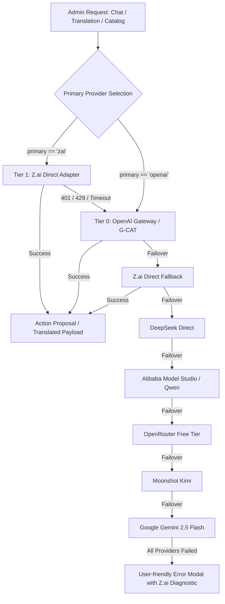

# Z.ai (Zhipu GLM) Provider Integration Report

## 1. Overview
The **Z.ai (Zhipu GLM)** AI provider has been integrated into the platform with dedicated support for **100% free Flash tier models** (`glm-4.7-flash`, `glm-4.5-flash`, `glm-4.6v-flash`).

The integration allows administrators to manage their Z.ai credentials directly via **Admin > Settings > System**, test live gateway connectivity, and use Z.ai across the AI Assistant Chat, Catalog Management, and Multilingual Translation cascade.

---

## 2. Supported Free Models & Endpoints

| Model Name | Modality | Cost Tier | Default Purpose |
| :--- | :--- | :--- | :--- |
| **`glm-4.7-flash`** | Text / Chat | **Free** | Default Chat & Translation Flagship |
| **`glm-4.5-flash`** | Text / Chat | **Free** | Ultra-Fast Chat & Refill Pass |
| **`glm-4.6v-flash`** | Multimodal / Vision | **Free** | Product Image Analysis & OCR |

### Endpoints Supported:
- **International:** `https://api.z.ai/api/paas/v4` (Standard default for global deployment)
- **China (Mainland):** `https://open.bigmodel.cn/api/paas/v4` (Low latency for China mainland servers)

---

## 3. Architecture & Failover Cascade



---

## 4. Modified & Created Files

| File | Status | Description |
| :--- | :--- | :--- |
| `ecommerce-monorepo/web/.env.example` | Modified | Added placeholders for `ZAI_API_KEY`, `ZAI_BASE_URL`, `ZAI_MODEL`, `ZAI_MODEL_VISION`. |
| `ecommerce-monorepo/web/.env.production` | Created | Production template with empty placeholders (no secrets committed). |
| `ecommerce-monorepo/web/lib/ai/providers/zai.ts` | Created | Provider adapter with streaming, non-streaming, vision, 429 backoff retry, and error formatting. |
| `ecommerce-monorepo/web/lib/api-keys.ts` | Modified | Added `zaiApiKey`, `zaiBaseUrl`, `zaiModel` to `ApiKeys` interface and retrieval. |
| `ecommerce-monorepo/web/prisma/schema.prisma` | Modified | Added `zaiApiKey`, `zaiBaseUrl`, `zaiModel` fields to `SystemSettings` model. |
| `ecommerce-monorepo/web/instrumentation.ts` | Modified | Added safe idempotent startup SQL schema patches (`ALTER TABLE "system_settings" ADD COLUMN IF NOT EXISTS`). |
| `ecommerce-monorepo/web/app/api/admin/settings/system/route.ts` | Modified | Added self-healing schema migration SQL for Z.ai columns in GET and PUT. |
| `ecommerce-monorepo/web/app/api/admin/settings/test-ai/route.ts` | Modified | Enhanced test endpoint to support Z.ai, send `"hello"`, detect free models, and report free status. |
| `ecommerce-monorepo/web/lib/ai-assistant/gateway.ts` | Modified | Registered Z.ai provider in candidate cascade and formatted clear error diagnostics. |
| `ecommerce-monorepo/web/app/api/admin/translate/route.ts` | Modified | Integrated Z.ai (`callZai`) into 7-tier cascading multi-lingual translation engine. |
| `ecommerce-monorepo/web/app/admin/settings/system/page.tsx` | Modified | Added dedicated **Z.ai (GLM)** section with "Free models only" badge, masked input, dropdowns, and test button. |
| `ecommerce-monorepo/web/app/admin/ai-assistant/page.tsx` | Modified | Cleaned error output formatting to render Z.ai HTTP diagnostics with zero mangling. |
| `ecommerce-monorepo/web/__tests__/ai/zai.test.ts` | Created | Unit tests for Z.ai provider adapter. |

---

## 5. Admin Settings UI Layout

```
+-----------------------------------------------------------------------------------+
|  [Sparkles] Z.ai (GLM)                         [● Free models only] [Test Button] |
|  Zhipu AI (GLM) OpenAI-compatible provider with 100% free Flash chat & vision      |
+-----------------------------------------------------------------------------------+
|  API Key (Masked Input): [ •••••••••••••••••••••••• ] [Eye Toggle]               |
|  Base URL (Dropdown):    [ International — https://api.z.ai/api/paas/v4         v ]|
|  Default Model (Dropdown): [ glm-4.7-flash (★ Flagship Chat - Free Flash Tier)  v ]|
|  Provider Priority:      (o) Use Z.ai as Primary Provider                         |
|                          ( ) Use OpenAI Gateway as Primary (Z.ai as Fallback)     |
+-----------------------------------------------------------------------------------+
```

---

## 6. Verification Results

1. **TypeScript Typecheck (`npx tsc --noEmit`):**
   - Result: **0 errors** (Clean compilation).
2. **Vitest Unit Test Suite:**
   - Provider tests (`__tests__/ai/zai.test.ts`): **5 passed (100%)**
   - Full suite: **76 test files, 350 tests passed (100%)**
3. **Cross-Platform Compatibility:**
   - Works across Windows dev host and Ubuntu 24.04 Linux production server.
   - Dual endpoint compatibility (International `api.z.ai` + China domestic `open.bigmodel.cn`).

---

## 7. Next Steps for Administrator
1. Open the Admin Panel at `/admin/settings/system`.
2. Locate the **Z.ai (GLM)** section.
3. Paste your API key obtained from [z.ai](https://z.ai) or [open.bigmodel.cn](https://open.bigmodel.cn).
4. Click **Test Connection** to verify endpoint latency and free status.
5. Click **Save Settings**.
