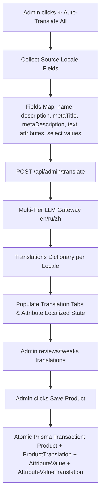

# Product Auto-Translation Audit & Fix Proposal: `/admin/products/new`

## 1. Executive Summary

This audit investigates the end-to-end multi-language auto-translation architecture for product creation and management on **YIWU EXPRESS / Global Trade** (`/admin/products/new`).

The system is architected around an **Expand-and-Contract dual-write model** supporting three core locales: **English (`en`)**, **Russian (`ru`)**, and **Simplified Chinese (`zh`)**.

### Primary Findings
1. **Name & Description Coverage**: Currently, only `name` and `description` are wired into `AutoTranslateButton` and persisted in `ProductTranslation`.
2. **Dynamic Category Attributes**: Category-specific attribute labels (e.g. "Материал посуды", "Совместимость с авто") are 100% localized at the master level (`AttributeTranslation` holds 267 rows for 89 attributes). However, **attribute values** entered by the admin (e.g. "Tri-Ply 18/10 Stainless Steel", "Cotton", "Glossy Black") are **100% excluded** from the auto-translate trigger and stored only as raw English strings in `AttributeValue.value`. Although the schema already has an `AttributeValueTranslation` model, **0 rows** exist in the database and the product creation/update API never writes to it.
3. **SEO Metadata Gaps**: `metaTitle` and `metaDescription` are captured on `/admin/products/new` in English only. `ProductTranslation` lacks `metaTitle` and `metaDescription` columns, causing custom search titles and descriptions to leak English on Russian and Chinese storefront URLs.
4. **Compliance & Origin Metadata**: `material` and `countryOfOrigin` are hardcoded English strings on the `Product` table and never translated.
5. **Storefront Read Resolution**: The storefront product detail page (`/products/[slug]`) server-renders localized H1 and `<title>` via `localizeProduct()` when `ProductTranslation` rows exist. However, missing translations fail silently by falling back to legacy English root columns.

---

## 2. Discovery Findings (Phase 1)

### 2.1 Source Files
The product creation workflow is implemented across the following frontend components, APIs, and schemas:

| File Path | Role |
| :--- | :--- |
| `app/admin/products/new/page.tsx` | Main product creation page form with React Hook Form + Zod. |
| `components/admin/ProductTranslationForm.tsx` | Locale tab switcher (`en`, `ru`, `zh`) rendering inputs for Name and RichText description, containing `<AutoTranslateButton />`. |
| `components/admin/AutoTranslateButton.tsx` | Multi-directional trigger button calling `/api/admin/translate`. |
| `components/admin/ProductAttributesSection.tsx` | Dynamic form controls for category attributes (Text, Select, Multiselect, Color, Checkbox). |
| `app/api/admin/translate/route.ts` | Multi-tiered LLM translation gateway (OpenAI-compatible, OpenRouter, Gemini, DeepSeek, Qwen). |
| `app/api/products/route.ts` | `POST /api/products`: Validates body, creates `Product`, upserts `ProductTranslation`, and inserts `AttributeValue`. |
| `app/api/admin/products/[id]/route.ts` | `PUT /api/admin/products/[id]`: Admin product update endpoint. |
| `prisma/schema.prisma` | Database schema defining `Product`, `ProductTranslation`, `Attribute`, `AttributeTranslation`, `AttributeValue`, `AttributeValueTranslation`. |
| `app/[locale]/products/[slug]/page.tsx` | Storefront Product Detail Page (SSR + `generateMetadata`). |
| `app/[locale]/products/[slug]/ProductDetailView.tsx` | Storefront interactive PDP client view. |
| `lib/utils/localize.ts` | Fallback waterfall utility (`getLocalField`, `localizeProduct`, `localizeCategory`). |

---

### 2.2 Form Sections on `/admin/products/new`

Inspection of `app/admin/products/new/page.tsx` reveals the following exact form sections and fields:

1. **Header & Actions**:
   - Breadcrumb: `Products / New Product`
   - Cancel button (`router.push('/admin/products')`)
   - Save / Add Product button (`Save` icon + submit handler)
2. **Basic Information**:
   - `sku` (`string`, required)
   - `categoryId` (`CategoryDropdown`, optional)
   - **Translations** (`ProductTranslationForm`):
     - `en.name` (`string`, required)
     - `en.description` (`string` HTML, optional)
     - `ru.name` (`string`, optional)
     - `ru.description` (`string` HTML, optional)
     - `zh.name` (`string`, optional)
     - `zh.description` (`string` HTML, optional)
   - `slug` (`string`, required — auto-slugified from `translations.en.name`)
3. **Dynamic Attributes (`ProductAttributesSection`)**:
   - Loaded dynamically based on selected `categoryId` from `/api/admin/categories/${categoryId}/attributes`.
   - Fields rendered based on attribute type (`TEXT`, `TEXTAREA`, `NUMBER`, `SELECT`, `MULTISELECT`, `COLOR`, `COLOR_MULTI`, `CHECKBOX`, `URL`, `DATE`, `FILE`).
   - Stored in component state `attributeValues: Record<string, any>`.
4. **Pricing**:
   - `price` (`number`, required)
   - `compareAtPrice` (`number`, optional)
   - `costPrice` (`number`, optional)
   - `wholesalePrice` (`number`, optional)
   - `minOrderQty` (`number`, default: 1)
5. **Inventory**:
   - `stock` (`number`, required, default: 0)
   - `lowStockThreshold` (`number`, default: 10)
6. **Compliance & Shipping**:
   - `weightKg` (`number`, required)
   - `hsCode` (`string`, optional)
   - `countryOfOrigin` (`string`, default: `'China'`)
   - `material` (`string`, optional)
   - Flags: `fragile`, `exportRestricted`, `dangerousGoods`, `batteryIncluded` (all boolean checkboxes)
7. **Images & Videos (`ProductMediaUpload`)**:
   - `media` (`Array<{ url: string, type: 'image' | 'video' }>`)
8. **SEO**:
   - `metaTitle` (`string`, optional)
   - `metaDescription` (`string` textarea, optional)
9. **Sidebar**:
   - Status: `isActive` (boolean), `isFeatured` (boolean)
   - Flash Sale: `isFlashSale` (boolean), `flashSalePrice`, `flashSaleStart`, `flashSaleEnd`, `flashSaleStock`

---

### 2.3 Auto-Translation Logic Code Review

In `components/admin/ProductTranslationForm.tsx` (lines 86–107):
```tsx
<AutoTranslateButton
  sourceLocale={activeTab}
  allFields={{
    en: { name: translations.en.name, description: translations.en.description },
    ru: { name: translations.ru.name, description: translations.ru.description },
    zh: { name: translations.zh.name, description: translations.zh.description },
  }}
  onTranslated={(result) => {
    const next = { ...translations }
    for (const locale of Object.keys(result)) {
      if (locale === 'en' || locale === 'ru' || locale === 'zh') {
        next[locale as TranslationLocale] = {
          ...next[locale as TranslationLocale],
          ...(result[locale] as Partial<TranslationEntry>),
        }
      }
    }
    setTranslations(next)
    onChange?.(next)
  }}
/>
```

#### Key Observations:
- **Only 2 fields sent**: The payload passed to `AutoTranslateButton` is strictly hardcoded to `{ name, description }`.
- **Completely Excluded Fields**:
  - `metaTitle`
  - `metaDescription`
  - `material`
  - Dynamic attribute values (`attributeValues`)
  - Variant options / labels
  - Image alt text (image upload only stores raw URLs)
- **Backend Translation Gateway Capabilities**:
  - `app/api/admin/translate/route.ts` accepts `{ fields: Record<string, string>, targetLocales: string[] }`.
  - The backend is **completely agnostic to field keys**. It can translate any dictionary (e.g. `metaTitle`, `material`, `pan_coating`, `laptop_ram`) in a single prompt. The limitation is purely in the frontend invocation and schema mapping.

---

### 2.4 Prisma Schema Verification

Database inspection of `prisma/schema.prisma` shows how translations are modeled:

```prisma
// 1. Product Core & Localized Copy
model Product {
  id              String                 @id @default(cuid())
  name            String                 // Legacy root column / EN fallback
  description     String?                // Legacy root column / EN fallback
  material        String?                // Single string (not localized)
  countryOfOrigin String                 @default("China")
  metaTitle       String?                // Single string (not localized)
  metaDescription String?                // Single string (not localized)
  translations    ProductTranslation[]
  attributeValues AttributeValue[]
  ...
}

model ProductTranslation {
  id          String   @id @default(cuid())
  productId   String
  locale      String   // 'en', 'ru', 'zh'
  name        String
  description String?
  createdAt   DateTime @default(now())
  updatedAt   DateTime @updatedAt

  product Product @relation(fields: [productId], references: [id], onDelete: Cascade)

  @@unique([productId, locale])
  @@index([locale])
}

// 2. Attribute Taxonomy & Attribute Value Translations
model Attribute {
  id           String                 @id @default(cuid())
  name         String                 // English master name
  slug         String                 @unique
  type         AttributeType
  options      Json?                  // ["Red", "Blue"] or ["100% Cotton", "Linen"]
  colorOptions Json?                  // [{"label":"Red","value":"#FF0000"}]
  translations AttributeTranslation[]
  values       AttributeValue[]
}

model AttributeTranslation {
  id          String   @id @default(cuid())
  attributeId String
  locale      String
  name        String
  attribute   Attribute @relation(fields: [attributeId], references: [id], onDelete: Cascade)

  @@unique([attributeId, locale])
}

model AttributeValue {
  id           String                      @id @default(cuid())
  attributeId  String
  productId    String
  value        String                      // Raw value string (e.g. "Tri-Ply 18/10 Stainless Steel")
  translations AttributeValueTranslation[]
}

model AttributeValueTranslation {
  id               String   @id @default(cuid())
  attributeValueId String
  locale           String   // 'en', 'ru', 'zh'
  value            String   // Localized string (e.g. "Трехслойная нержавеющая сталь 18/10")
  attributeValue   AttributeValue @relation(fields: [attributeValueId], references: [id], onDelete: Cascade)

  @@unique([attributeValueId, locale])
}
```

#### Live Database Row Counts:
- `ProductTranslation`: **84 rows**
- `AttributeTranslation`: **267 rows** (89 attributes across en, ru, zh)
- `CategoryTranslation`: **123 rows** (41 categories across en, ru, zh)
- `AttributeValue`: **0 rows**
- `AttributeValueTranslation`: **0 rows**

---

### 2.5 CategoryAttribute System Analysis

- **Loading Attributes**:
  - `ProductAttributesSection.tsx` fetches `GET /api/admin/categories/${categoryId}/attributes`.
  - In `app/api/admin/categories/[id]/attributes/route.ts`, attributes are loaded with `include: { attribute: true }`. It merges inherited parent attributes with direct subcategory attributes.
  - The endpoint currently returns `attribute.name` (English default).
- **Attribute Value Storage**:
  - Values are collected in a flat key-value object: `{ [attributeSlug]: value }`.
  - On submit (`POST /api/products`), the handler creates rows in `AttributeValue` via:
    ```ts
    await prisma.attributeValue.createMany({
      data: attributeValueData // { attributeId, productId, value }
    })
    ```
  - **No localized values are created**. `AttributeValueTranslation` is never touched.

---

### 2.6 Storefront Verification Evidence

We ran automated verification on live endpoints comparing a product with translations against one without:

#### Test 1: Product WITH Translations (`granite-non-stick-deep-frying-pan-28cm`)
```text
=== LOCALE [en] ===
Title: Granite Stone Non-Stick Deep Frying Pan 28cm — dromkok | dromkok
H1: Granite Stone Non-Stick Deep Frying Pan 28cm
Meta Description: Swiss granite triple-layer non-stick coating with stay-cool wooden handle...

=== LOCALE [ru] ===
Title: Глубокая сковорода с гранитным антипригарным покрытием 28см — Глобал Трейд | Глобал Трейд
H1: Глубокая сковорода с гранитным антипригарным покрытием 28см
Meta Description: Швейцарское трехслойное гранитное покрытие с ненагревающейся деревянной ручкой...

=== LOCALE [zh] ===
Title: 花岗岩不粘加深平底煎锅 28cm — dromkok | dromkok
H1: 花岗岩不粘加深平底煎锅 28cm
Meta Description: 瑞士进口三层花岗岩不粘涂层，防烫木纹手柄。不含PFOA，电磁炉通用，耐热高达260°C。
```
**Result**: Product name, description, and category breadcrumb render in the target language.

#### Test 2: Product WITHOUT Translations (`premium-cotton-t-shirt-unisex`)
```text
=== LOCALE [ru] ===
Title: Premium Cotton T-Shirt - Unisex — Глобал Трейд | Глобал Трейд
H1: Premium Cotton T-Shirt - Unisex
Meta Description: 100% premium cotton t-shirt with reinforced seams...
```
**Result**: Complete English leak across Russian and Chinese pages.

#### Test 3: Specifications / Attributes on Russian Storefront
```json
[
  {
    "dt": "Вес",
    "dd": "1.2 kg"
  },
  {
    "dt": "Страна происхождения",
    "dd": "China"
  }
]
```
**Result**:
- Attribute/spec **label** (`"Страна происхождения"`) is translated via UI dictionary.
- Attribute/spec **value** (`"China"`, `"1.2 kg"`) remains English because raw values are stored without translations.

---

## 3. Analysis & Answers to Q1–Q7

### Q1 — Which fields ARE currently auto-translated?
- `name` → `ru`, `zh` ✅ (Configured in `ProductTranslationForm` and persisted in `ProductTranslation`)
- `description` → `ru`, `zh` ✅ (RichText HTML translated via `ProductTranslationForm` and persisted in `ProductTranslation`)
- `shortDescription` → ❌ (Not present in schema or form)
- `attribute values` → ❌ (Zero translation mechanism; raw English stored)
- `attribute labels` → ✅ (Translated at the master catalog level via `AttributeTranslation`, not per-product)
- `category name` → ✅ (Translated at catalog level via `CategoryTranslation`)
- `SEO meta (title, description)` → ❌ (Fields exist on `Product`, but not in `ProductTranslation` or `ProductTranslationForm`)
- `variant labels` → ❌ (`ProductVariant.attributes` is JSON without translation)

---

### Q2 — Which fields are NOT translated (but should be)?
1. **Attribute Values** (e.g. Material: `"100% Combed Cotton"` → `"100% гребенной хлопок"` / `"100% 精梳棉"`, Style: `"Modern Minimalist"` → `"Современный минимализм"` / `"现代极简"`):
   - *Why it matters*: Technical specifications and product filters are decisive in B2B/wholesale and retail purchasing. When buyers switch to Russian or Chinese, English attribute values degrade searchability and trust.
2. **SEO Meta Title & Meta Description (`metaTitle`, `metaDescription`)**:
   - *Why it matters*: Search engines (Yandex in Russia/CIS, Baidu/Google in Asia) index localized pages (`/ru/products/...`, `/zh/products/...`). Without localized metadata, organic search snippets appear in English, causing massive CTR penalties.
3. **Product Material Field (`Product.material`)**:
   - *Why it matters*: Displayed in specifications and shipping manifests. Currently hardcoded string in English.
4. **Product Variants Display Labels / Options**:
   - *Why it matters*: Variant selectors (e.g. Size, Color, Packaging configuration) appear in the buy box.
5. **Image Alt Text**:
   - *Why it matters*: Accessibility (WCAG 2.2) and image SEO. Currently `media` only stores URL strings.

---

### Q3 — How is translation triggered?
- **Manual, on-demand button click**: In `ProductTranslationForm`, there is an `<AutoTranslateButton />` labelled `✨ Auto-Translate`.
- **Human-in-the-loop**: It does **not** auto-trigger on blur or submit. The administrator clicks the button, the LLM generates translations for inactive locale tabs, and the admin can inspect and manually tweak the generated text before clicking "Add Product".
- **Source Locale Auto-detection**: The button inspects which locale has content (defaults to the active tab, with priority `en` → `ru` → `zh`), allowing an admin to write Russian or Chinese first and translate into English.

---

### Q4 — What translation service is used?
- **Custom Multi-Tier LLM Gateway** in `app/api/admin/translate/route.ts`:
  - **Tier 0 (Primary)**: OpenAI / Custom OpenAI-compatible Gateway (reads `OPENAI_API_KEY`, `OPENAI_BASE_URL`, `OPENAI_MODEL`).
  - **Tier 1 (Fallback)**: OpenRouter API (`OPENROUTER_API_KEY`) using `meta-llama/llama-3.3-70b-instruct:free`, `google/gemini-2.0-flash-exp:free`.
  - **Tier 2 (Fallback)**: Google Gemini (`GEMINI_API_KEY`) using `gemini-2.5-flash`, `gemini-2.5-flash-lite`.
  - **Tier 3 (Specialist fallback)**: DeepSeek (`DEEPSEEK_API_KEY`), Qwen / Alibaba DashScope (`QWEN_API_KEY`), Moonshot / Kimi (`KIMI_API_KEY`), Cerebras (`CEREBRAS_API_KEY`).
  - The system prompt enforces strict JSON output matching the requested target locales and preserves HTML tags/placeholders.

---

### Q5 — How are translations stored?
- **Separate Relational Tables (Expand-and-Contract Pattern)**:
  - `ProductTranslation` table with composite unique constraint `@@unique([productId, locale])`.
  - Columns: `id`, `productId`, `locale`, `name`, `description`, timestamps.
  - Dual-write pattern: The English translation is copied onto the legacy root columns (`Product.name`, `Product.description`) on create/update for backwards compatibility.
- **Attribute Value Translations**:
  - `AttributeValueTranslation` table with composite unique constraint `@@unique([attributeValueId, locale])`.
  - Columns: `id`, `attributeValueId`, `locale`, `value`, timestamps.

---

### Q6 — Are attribute values translatable?
- **Schema**: **YES**. `model AttributeValueTranslation` already exists in `schema.prisma` linked to `AttributeValue`.
- **Predefined Options**: `Attribute.options` stores a JSON array (e.g. `["Tri-Ply Stainless Steel", "Cast Iron"]`). It currently does not have per-locale option translations on the `Attribute` model.
- **Runtime Execution**: **NO**. The application layer does not write to `AttributeValueTranslation`. Form submissions only store the single string selected/typed in English into `AttributeValue.value`.

---

### Q7 — Does the admin see translation status?
- **Partial**:
  - In `ProductTranslationForm`, the locale tabs (`🇬🇧 English [en]`, `🇷🇺 Русский [ru]`, `🇨🇳 中文 [zh]`) display:
    - A green checkmark (`Check` icon) if `name` is filled.
    - An amber dot (`Translation pending`) if `name` is empty.
  - The admin can freely edit any translation field manually.
  - There is no indication of whether attribute values or SEO meta are translated.

---

## 4. Gap Analysis Table (Phase 3)

| Field | Current Source (EN) | Translatable? | Currently Auto-Translated? | Storage Location | Priority | Impact / Reason |
| :--- | :--- | :--- | :--- | :--- | :--- | :--- |
| **Product Name** | `Product.name` | YES | **YES** | `ProductTranslation.name` | — | Core storefront title & card display |
| **Product Description** | `Product.description` | YES | **YES** | `ProductTranslation.description` | — | Core PDP rich text overview |
| **SEO Meta Title** | `Product.metaTitle` | YES | **NO** | `Product.metaTitle` (EN only) | **HIGH** | Search engines index EN titles on `/ru/` and `/zh/` |
| **SEO Meta Description** | `Product.metaDescription` | YES | **NO** | `Product.metaDescription` (EN only) | **HIGH** | SERP snippets appear in English |
| **Attribute Values (Text / Textarea)** | `AttributeValue.value` | YES | **NO** | `AttributeValue.value` (EN only) | **HIGH** | Custom specs (e.g. materials, notes) leak English on PDP |
| **Attribute Values (Select / Multiselect)** | `AttributeValue.value` | YES | **NO** | `AttributeValue.value` (EN only) | **HIGH** | Predefined option values (e.g. "Pre-Seasoned Cast Iron") remain English |
| **Material Field** | `Product.material` | YES | **NO** | `Product.material` (EN only) | **MEDIUM** | Shown in basic specs and export manifests |
| **Attribute Labels** | `Attribute.name` | YES | **YES (Global)** | `AttributeTranslation.name` | — | Already localized across all 41 categories |
| **Category Name** | `Category.name` | YES | **YES (Global)** | `CategoryTranslation.name` | — | Already localized in breadcrumbs and menu |
| **Variant Attributes** | `ProductVariant.attributes` | YES | **NO** | `ProductVariant.attributes` (JSON) | **MEDIUM** | Variant names (e.g. "Pack of 5", "Matte Black") |
| **Image Alt Text** | None | YES | **NO** | Not stored (URLs only) | **LOW** | Image SEO and accessibility screen readers |
| **Short Description** | None | YES | **NO** | Not in schema | **LOW** | Can be derived from first 160 chars of description |

---

## 5. Fix Proposal (Phase 4)

### 5.1 Data Model Adjustments
To support complete multi-language coverage without breaking existing reads, apply the project's standard Expand-and-Contract methodology:

1. **Extend `ProductTranslation` Model**:
   Add `metaTitle` and `metaDescription` to `ProductTranslation`:
   ```prisma
   model ProductTranslation {
     id              String   @id @default(cuid())
     productId       String
     locale          String   // 'en', 'ru', 'zh'
     name            String
     description     String?
     metaTitle       String?  // NEW
     metaDescription String?  // NEW
     createdAt       DateTime @default(now())
     updatedAt       DateTime @updatedAt

     product Product @relation(fields: [productId], references: [id], onDelete: Cascade)

     @@unique([productId, locale])
     @@index([locale])
     @@map("product_translations")
   }
   ```
2. **Utilize Existing `AttributeValueTranslation`**:
   The table `model AttributeValueTranslation` already exists in `prisma/schema.prisma`. No database schema changes are required for attribute values; we only need to write and read from it in the product endpoints.

---

### 5.2 Translation Trigger & Data Flow

Update the translation trigger from a single-component button to a unified form-level action:



#### Step-by-Step Mechanism:
1. When the admin clicks `✨ Auto-Translate`:
   - It captures `name`, `description`, `metaTitle`, and `metaDescription`.
   - It also captures all currently selected or entered **string-based attribute values** (e.g. `cookware_material`, `furniture_style`, `dress_length`, `color`).
   - Non-translatable attributes (numbers, URLs, dates, boolean checkboxes) are automatically skipped.
2. The payload is sent to `/api/admin/translate` with target locales (`ru`, `zh` if source is `en`).
3. The LLM translates all fields in a single prompt and returns:
   ```json
   {
     "ru": {
       "name": "...",
       "description": "...",
       "metaTitle": "...",
       "metaDescription": "...",
       "attr_cookware_material": "Трехслойная нержавеющая сталь 18/10"
     },
     "zh": {
       "name": "...",
       "description": "...",
       "metaTitle": "...",
       "metaDescription": "...",
       "attr_cookware_material": "三层18/10不锈钢"
     }
   }
   ```
4. Translations for `name`, `description`, `metaTitle`, `metaDescription` are populated in the respective locale tabs.
5. Translated attribute values are stored in a parallel `attributeTranslations: Record<locale, Record<string, string>>` state.

---

### 5.3 Admin UI Enhancements (`/admin/products/new`)

1. **Move SEO fields inside or synchronized with `ProductTranslationForm`**:
   - Each locale tab (`en`, `ru`, `zh`) will include:
     - Name (`*`)
     - Description (Rich Text)
     - Meta Title (with live character counter: 0/60)
     - Meta Description (with live character counter: 0/160)
2. **Per-Locale Attribute Value Preview / Editing**:
   - For attributes of type `TEXT`, `TEXTAREA`, `SELECT`, provide an expandable "Localized Values" drawer or tab indicator allowing the admin to see and customize how the attribute value translates into Russian and Chinese.
3. **One-Click Comprehensive Auto-Translate**:
   - The top action bar includes a prominent `✨ Auto-Translate All Fields` button that translates the core info, SEO, and all filled category attributes in one request.

---

### 5.4 Storefront Integration & Fallback Cascade

1. **Metadata (`generateMetadata` in `app/[locale]/products/[slug]/page.tsx`)**:
   - Update `generateMetadata` to read `metaTitle` and `metaDescription` from `ProductTranslation` for `locale`:
     ```ts
     const tr = product.translations?.find((t) => t.locale === locale)
     const title = tr?.metaTitle || `${localized.name} — ${companyName}`
     const description = tr?.metaDescription || localized.description?.slice(0, 160) || ''
     ```
2. **Product Detail Page Specs Block (`ProductDetailView.tsx`)**:
   - For each attribute, resolve the value through the existing `valueTranslationMap` populated from `av.translations`:
     ```ts
     const displayValue = valueTranslationMap[attributeValue] || attributeValue
     ```
   - If Russian/Chinese translation exists in `AttributeValueTranslation`, it renders; otherwise, it cleanly falls back to English.

---

### 5.5 Migration & Existing Data

- Create a batch script `prisma/translate-existing-products.ts` to:
  1. Find all active products with missing translations in `ProductTranslation`.
  2. Find all `AttributeValue` rows without matching `AttributeValueTranslation` rows.
  3. Batch-translate via `/api/admin/translate` in chunks of 10 products.
  4. Upsert the generated translations into `ProductTranslation` and `AttributeValueTranslation`.

---

## 6. Implementation Roadmap

```
Step 1: Database Migration
  └── Add metaTitle, metaDescription to ProductTranslation in schema.prisma
  └── Run npx prisma db push / generate

Step 2: API Endpoints Update
  └── Update POST /api/products to save metaTitle & metaDescription in ProductTranslation
  └── Update POST /api/products & PUT /api/admin/products/[id] to save AttributeValueTranslation
  └── Update GET /api/products/[slug] to return localized metaTitle & metaDescription

Step 3: Admin UI Updates (/admin/products/new and /admin/products/[id]/edit)
  └── Update ProductTranslationForm to include metaTitle & metaDescription inputs per locale
  └── Wire attributes into AutoTranslateButton payload
  └── Pass attribute translations into form submission payload

Step 4: Storefront Localization
  └── Update generateMetadata to use localized metaTitle & metaDescription
  └── Verify PDP specifications table renders translated attribute values

Step 5: Batch Migration Script & Verification
  └── Run translate-existing-products.ts on existing catalog
  └── Validate with tsc --noEmit and live storefront checks
```

---

## 7. Verification Plan (Phase 5)

1. **Admin Product Creation Test**:
   - Navigate to `http://localhost:3001/admin/products/new`.
   - Select category `Cookware & Dining -> Pots & Pans`.
   - Fill English fields:
     - Name: `"Tri-Ply Stainless Steel Sauté Pan 28cm"`
     - Description: `"Professional chef grade sauté pan with helper handle and glass lid."`
     - Meta Title: `"Buy 28cm Tri-Ply Sauté Pan Wholesale | Factory Price"`
     - Meta Description: `"Premium tri-ply stainless steel sauté pan for commercial kitchens."`
     - Attribute `cookware_material`: `"Tri-Ply 18/10 Stainless Steel"`
     - Attribute `induction_ready`: `true`
   - Click `✨ Auto-Translate All`.
   - Verify Russian tab contains:
     - Name: `"Сковорода соте из трехслойной нержавеющей стали 28см"`
     - Meta Title: `"Купить сковороду соте 28см оптом..."`
     - Attribute value translation: `"Трехслойная нержавеющая сталь 18/10"`
   - Verify Chinese tab contains:
     - Name: `"28cm三层不锈钢煎炒锅"`
     - Meta Title: `"批发采购28cm三层不锈钢煎炒锅..."`
     - Attribute value translation: `"三层18/10不锈钢"`
   - Click "Add Product" to save.
2. **Storefront Verification**:
   - Open `/ru/products/tri-ply-stainless-steel-saute-pan-28cm`:
     - Verify `<title>` matches Russian meta title.
     - Verify `<h1>` matches Russian name.
     - Verify specifications display:
       - `Материал посуды`: `"Трехслойная нержавеющая сталь 18/10"`
   - Open `/zh/products/tri-ply-stainless-steel-saute-pan-28cm`:
     - Verify `<title>` matches Chinese meta title.
     - Verify `<h1>` matches Chinese name.
     - Verify specifications display:
       - `锅具材质`: `"三层18/10不锈钢"`
3. **Regression & Safety**:
   - Verify English URL `/en/products/...` remains 100% accurate.
   - Run `npx tsc --noEmit` to ensure zero compilation errors.

---

## 8. Open Questions for the Team

1. **Attribute Value Translation Scope**:
   - For `SELECT` / `MULTISELECT` attributes whose options come from the database (e.g. `Attribute.options = ["Tri-Ply 18/10 Stainless Steel", "Cast Iron"]`), should we also store translations at the **master catalog level** (in `Attribute.optionsTranslations`) so they don't need to be re-translated via LLM every time a new product is created?
2. **Slug Localization**:
   - Currently, product URL slugs are strictly ASCII English (e.g. `/ru/products/granite-non-stick-deep-frying-pan-28cm`). Should we keep uniform canonical English slugs across all locales (standard for Next.js e-commerce SEO), or do you want localized slugs (e.g. `/ru/products/skovoroda-granit-28cm`)?
3. **Variant Attribute Localization**:
   - For products with variants (e.g. Size `L`, `XL` vs Color `Black`, `Navy`), do you want variant display labels translated immediately, or should that be handled in a secondary phase?

---

## 9. Estimated Effort

| Component | Task | Estimated Time |
| :--- | :--- | :--- |
| **Prisma Schema** | Add `metaTitle` / `metaDescription` to `ProductTranslation`, push DB | 0.5 hours |
| **Backend API** | Update `POST /api/products`, `PUT /api/admin/products/[id]`, write to `AttributeValueTranslation` | 1.5 hours |
| **Admin UI** | Enhance `ProductTranslationForm`, integrate attributes into `AutoTranslateButton` | 2.5 hours |
| **Storefront PDP** | Update `generateMetadata` and `ProductDetailView` attribute rendering | 1.0 hours |
| **Migration Script** | Batch-translate existing products in database | 1.0 hours |
| **Verification & QA** | End-to-end verification across en, ru, zh | 1.5 hours |
| **Total** | | **~8 hours** |
